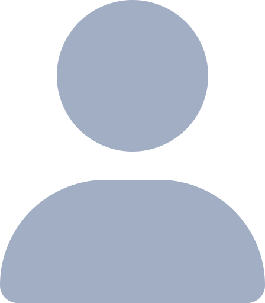

<h1 align="center"> 
  

  

<h3 align="center">👨‍💻 ABOUT ME 👨‍💻</h3>

I am currently a Fullstack Developer Bootcamp student, having completed the FullStack modules and now transitioning into backend development. With a strong foundation in HTML, CSS, and various frontend technologies, I am eager to deepen my backend expertise. I’m particularly drawn to the elegance of the color black and the strength of wolves, which inspire my creative approach to coding.

<h3 align="center">⚡ Skills & Technologies ⚡</h3>
<h4 align="center"> 🚀 Advanced </h4>

React.js

JavaScript (ES6+) 

SCSS (SASS)

React Router DOM

Axios

React Bootstrap

<h4 align="center">🔥 Intermediate </h4>

Redux / Redux Toolkit

Firebase

Material UI(MUI)

React Toastify

CSS Modules

Styled Components

Local Storage

Chart.js

Postman

TypeScript

Next.js

Cypress

<h3 align="center">⏳ Currently Learning ⏳</h3>

Backend Development

SQL 

Node.JS / Express 

Database 

Docker 

<h3 align="center">📡 How to Reach Me 📡</h3>

  
  &nbsp;&nbsp;&nbsp;
  
  &nbsp;&nbsp;&nbsp;
  

<h3 align="center">⚡ Status ⚡</h3>
 

  

    
    
  

          
  

    
  

