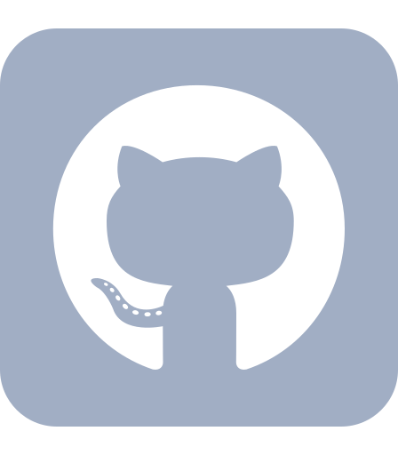

<h1 align="center">
  

  

  

<h3 align="center">👨‍💻 ABOUT ME 👨‍💻</h3>

I am currently a Fullstack Developer Bootcamp student with a passion for web development. I have a foundational understanding of HTML and CSS, and I'm excited to continue expanding my skills as I progress through my learning journey. I’m particularly drawn to the elegance of the color black and the strength of wolves, which inspire my creative approach to coding.

<h2 align="center">⚡ Skills & Technologies ⚡</h2>

Frontend</h3>

HTML (Basic Level)

CSS (Basic Level)

<h3 align="center">⏳ Currently Learning ⏳</h3>

Fullstack Web Development

Building responsive and interactive websites 

Strengthening my JavaScript and backend skills 

<h3 align="center">📡 How to Reach Me 📡</h3>

  
  

<h2 align="center">⚡ Status ⚡</h2>
 

  

    
    
  

          
  

    
  

